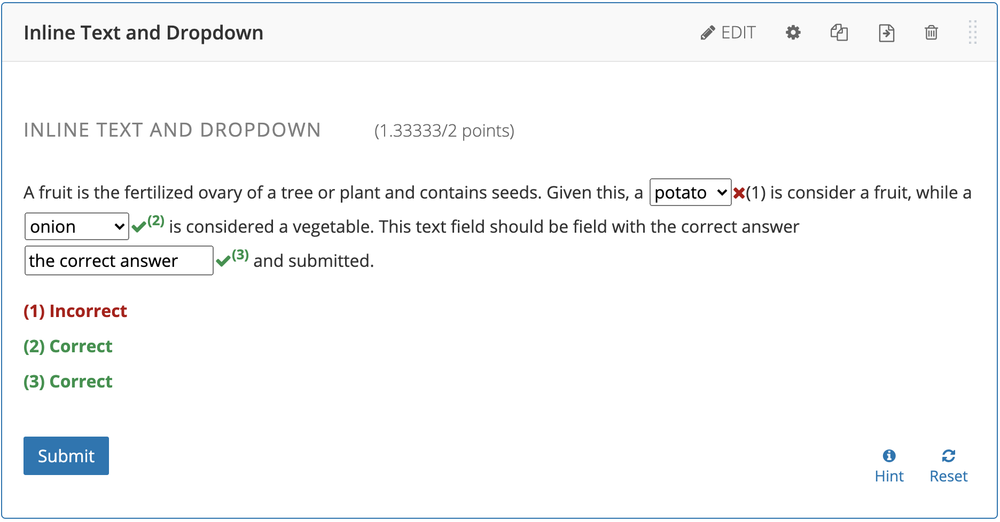
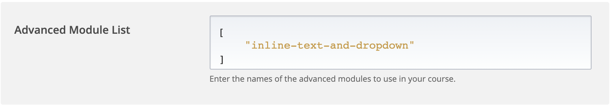
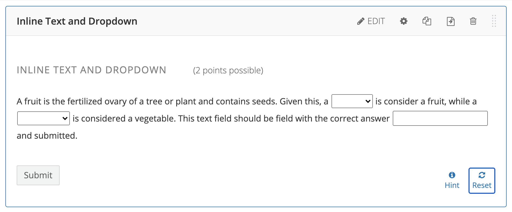
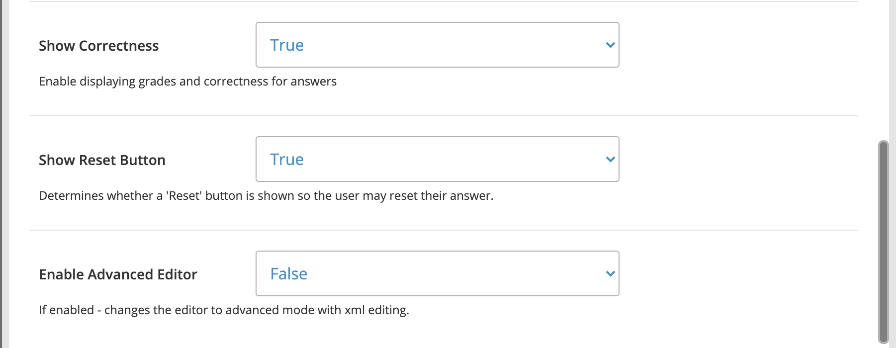
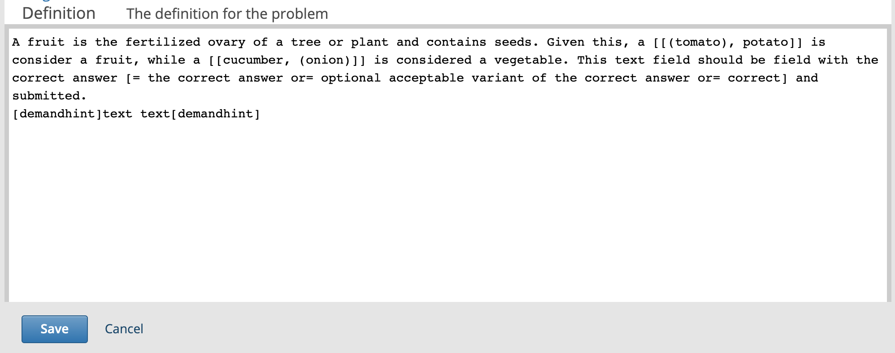
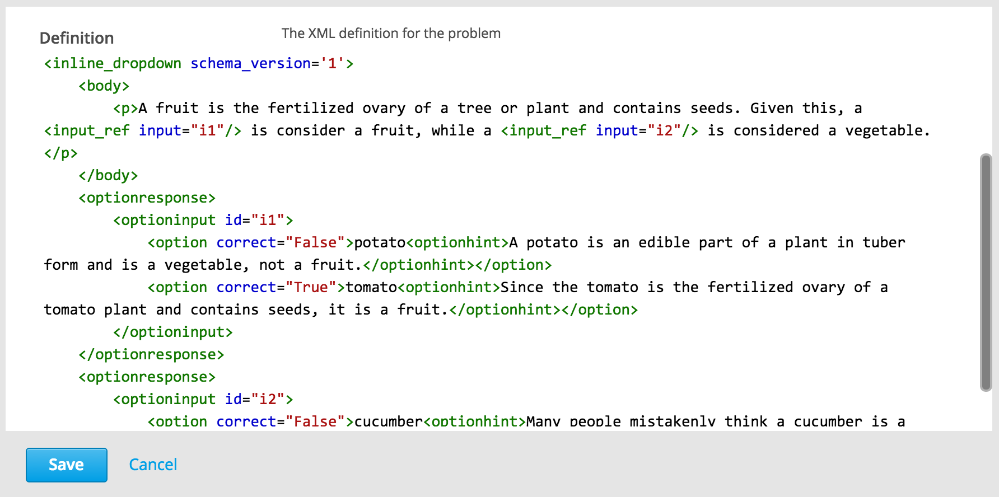

Inline Text and Dropdown XBlock
=========================
This XBlock provides a way to place text and dropdown questions inline with other text, for example, in a paragraph.



Installation
------------
To install the Inline Text and Dropdown XBlock within your edX python environment, simply run this command:

```bash
$ pip install -r requirements.txt
```

Enabling in Studio
------------------
Go to `Settings -> Advanced Settings` and set `Advanced Module List` to `["inline-text-and-dropdown"]`.



Usage
------------------
Once the Inline Text and Dropdown XBlock is enabled in Studio, you should see a new Component button labeled `Advanced`:


Click the `Advanced` button and you should see the Inline Text and Dropdown XBlock listed:


After you've selected the Inline Text and Dropdown XBlock, a default question will be inserted into your unit:



Customization
-------------
The question can be customized by clicking the `Edit` button on the component:




Default mode editing


Advanced mode editing


Markdown
-------------
The Inline Text and Dropdown XBlock in default mode uses a simple Markdown-based structure as shown below:
```bash
A fruit is the fertilized ovary of a tree or plant and contains seeds. Given this, a [[(tomato), potato]] is consider a fruit,
while a [[cucumber, (onion)]] is considered a vegetable. This text field should be field
with the correct answer [= the correct answer or= optional acceptable variant of the correct answer or= correct] and submitted.
[demandhint]Text hint.[demandhint]


```
and the next syntax for markdown view:
 * `[[(correct value), value]]` is used for dropdown;
 * `[= the correct answer or= alternative answer]` is used for text inputs;
 * `[demandhint]Hint that will be displayed[demandhint]` is used to display hints if necessary.

Advanced Mode
-------------
The Inline Text and Dropdown XBlock in advanced mode uses a simple XML-based structure as shown below:
```bash
<inline_text_and_dropdown schema_version='1'>
    <body>
        <p>A fruit is the fertilized ovary of a tree or plant and contains seeds. Given this, a <input_ref input="i1"/> is consider a fruit, while a <input_ref input="i2"/> is considered a vegetable. This text field should be field with the correct answer <input_ref input="i3"/> and submitted.</p>
    </body>
    <optionresponse>
       	<optioninput id="i1">
       		<option correct="True">tomato<optionhint>Since the tomato is the fertilized ovary of a tomato plant and contains seeds, it is a fruit.</optionhint></option>
       		<option correct="False">potato<optionhint>A potato is an edible part of a plant in tuber form and is a vegetable, not a fruit.</optionhint></option>
       	</optioninput>
    </optionresponse>
    <optionresponse>
       	<optioninput id="i2">
       		<option correct="False">cucumber<optionhint>Many people mistakenly think a cucumber is a vegetable. However, because a cucumber is the fertilized ovary of a cucumber plant and contains seeds, it is a fruit.</optionhint></option>
       		<option correct="True">onion<optionhint>The onion is the bulb of the onion plant and contains no seeds and is therefore a vegetable.</optionhint></option>
       	</optioninput>
    </optionresponse>
    <stringresponse answer="the correct answer" id="i3">
        <additional_answer answer="optional acceptable variant of the correct answer"/>
        <additional_answer answer="correct"/>
    </stringresponse>
    <demandhint>
        <hint>A fruit is the fertilized ovary from a flower.</hint>
        <hint>A fruit contains seeds of the plant.</hint>
    </demandhint>
</inline_text_and_dropdown>
```

